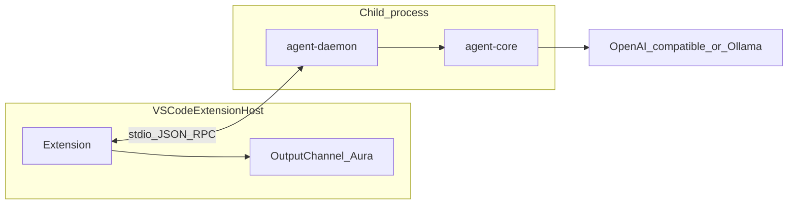

# Aura — Proof of Concept (POC) plan

This document is the **detailed POC execution plan**. It aligns with the umbrella roadmap in `.cursor/plans` (standalone agent platform): **POC proves the spine**—VS Code extension ↔ local daemon ↔ `agent-core` ↔ LLM with **Ask-only**, **read-only tools**, **stdio transport**, **streaming transcript**.

**POC is not MVP.** If a feature is not listed in [POC scope](#1-scope), defer it unless you explicitly extend POC (scope creep warning).

---

## 0. Metadata

| Field | Value |
|-------|--------|
| **Repository** | `aura` (this workspace) |
| **Publisher / product** | Joylitix · Aura (see branding in umbrella plan) |
| **Target duration** | ~3–10 working days (single engineer), depending on familiarity with VS Code extension API |
| **Stack** | TypeScript, Node 20+, pnpm workspaces, esbuild, Vitest (minimal use in POC) |

---

## 1. Scope

### 1.1 In scope (must ship for POC success)

1. **Monorepo** with pnpm workspaces and shared `tsconfig.base.json`.
2. **`packages/protocol`**: minimal **versioned** message types for:
   - `session/start` (includes `schemaVersion`, `workspaceRoot`, `workspaceId`, `threadId`, `mode: "ask"`, optional `modelId` / provider hints)
   - `chat/userMessage` + assistant/tool events (streaming-friendly: chunk or discrete events—pick one and document)
   - `tool/result`, `error`, `session/cancelled`
   - **Design goal**: fields chosen so **MVP does not break RPC** (same envelope, richer payloads later).
3. **`packages/agent-core`**:
   - **Ask mode only** (policy: read/search tools; **no** write, **no** shell, **no** patch).
   - Tool implementations: at minimum **`read_file`**, **`glob_file_search`** or **`grep`** (pick 2–3 tools that prove repo grounding).
   - LLM adapter: **OpenAI-compatible** `POST /v1/chat/completions` (or Responses if you standardize on one path) with tool calls; **Ollama** as second adapter using same tool-calling shape where supported (document model requirements).
   - **Single-thread transcript**: **JSONL** to disk under OS cache dir is acceptable for POC (path includes `workspaceId` + `threadId` when present).
4. **`packages/agent-daemon`**:
   - Process entry: load config from env + RPC **`session/start`** payload.
   - **Stdio JSON-RPC** (or NDJSON with length prefix—**pick one**, document framing rules).
   - Spawn **no TCP listener** in POC.
   - Forward tool calls to `agent-core`; stream assistant deltas back to parent.
   - **Path sandbox**: all file tools **restricted** to `workspaceRoot` (canonical resolved path; reject `..` breakout).
   - **Cancellation**: listen for cancel message and abort in-flight LLM request where possible.
5. **`packages/vscode-extension`**:
   - Command: **“Aura: Start session”** (or similar): spawn **child process** `node path/to/daemon-bundle.js`, **stdio** connected to extension host RPC client.
   - **Output Channel** “Aura” for transcript (MVP can upgrade to Webview). Streaming append per token or per chunk.
   - Configuration: `aura.openaiBaseUrl`, `aura.openaiApiKey` (secret), `aura.ollamaBaseUrl`, `aura.model`—**use `SecretStorage` for API keys**, not `settings.json`.
   - **Workspace folder**: single-root workspace only in POC (error if multi-root or pick first folder with warning).
6. **Build**: esbuild bundles for `agent-daemon` and extension `out/extension.js`; `tsc` for libraries if simpler for POC.

### 1.2 Explicitly out of scope (defer to MVP)

- **Modes** other than Ask (Brainstorm, Plan, Agent, Debug).
- **CLI** package (optional stub folder allowed; no parity work).
- **TCP + token**, Docker, compose.
- **MCP** servers and tool merge.
- **`host_call` / `vscode.debug`** (Debug mode).
- **Model download / `ollama pull` UI** (user may install models manually).
- **Desktop** app.
- **Sub-agents**, **parallel workers**, **git worktrees**.
- **Project settings file** `.agent/aura.json` merge (POC may read only global/workspace extension config).
- **Workspace registry** “recent projects” UX (daemon may still **write** registry record on `session/start` if cheap—optional; not required for POC exit).

### 1.3 POC exit criteria (Definition of Done)

- [ ] With a repo open in VS Code, user runs **Start session**, types a question, Aura **reads files** via tools and answers with **visible tool + model steps** in Output Channel.
- [ ] **No file writes** and **no shell** executed by the agent in POC runs.
- [ ] **Cancel** stops the run without orphan zombie processes in normal cases.
- [ ] README section **“POC setup”**: clone, `pnpm i`, `pnpm build`, F5 launch, env vars, Ollama optional path.
- [ ] One **Vitest** or node test: path sandbox rejects path outside `workspaceRoot`.

---

## 2. Architecture (POC)



**Rule**: No `import('vscode')` inside `agent-daemon` or `agent-core`.

---

## 3. Protocol sketch (POC v0)

> Final names live in code; this section is the **contract checklist**.

**Required methods / events**

1. `session/start` — client → daemon: `{ schemaVersion, workspaceRoot, workspaceId, threadId, mode: "ask", provider, modelId? }`
2. `session/ack` — daemon → client: `{ sessionId, capabilities: { tools: [...] } }`
3. `chat/appendUser` — user message
4. Stream of **`assistant/delta`**, **`tool/call`**, **`tool/result`**, **`assistant/done`**, **`error`**
5. `session/cancel` — client → daemon

**Versioning**: `schemaVersion: "0.1.0"` until MVP bumps minor/major per semver policy.

---

## 4. Implementation sequence (ordered)

### Sprint A — Repo + protocol (day 1)

1. Initialize pnpm workspace root: `package.json`, `pnpm-workspace.yaml`, `tsconfig.base.json`, `.gitignore` (node_modules, out, dist).
2. Create `packages/protocol` with exported types + constants (` SCHEMA_VERSION` ).
3. No publication to npm required; workspace protocol only.

### Sprint B — agent-core Ask loop (days 1–2)

1. Implement `completeLoop` pseudocode: messages + tools → LLM → until final or max steps (low cap, e.g. 8).
2. Implement tools with **pure functions** taking `workspaceRoot: string` and validated relative paths.
3. Unit test: sandbox boundary.

### Sprint C — agent-daemon stdio (days 2–3)

1. stdin/stdout message framing (document newline vs Content-Length).
2. Wire RPC to `agent-core` session factory.
3. Log to stderr only (never corrupt stdout protocol stream).

### Sprint D — vscode-extension (days 3–5)

1. `package.json` `contributes.commands`, `activationEvents: onCommand`
2. `ChildProcessWithoutShell` spawn daemon bundle; pass env `WORKSPACE_ROOT` if helpful.
3. RPC client: queue requests; demux stream events to Output Channel.
4. Secrets: `context.secrets.store` / `get` for API key; settings for non-secret URLs.

### Sprint E — Hardening + doc (days 5+)

1. Cancel on extension deactivate / disposable.
2. Failure modes: daemon crash → show error in Output Channel.
3. README POC setup.

---

## 5. File / package layout (POC target)

```text
aura/
  package.json
  pnpm-workspace.yaml
  tsconfig.base.json
  docs/
    POC_PLAN.md          # this file
  packages/
    protocol/
      src/index.ts
      package.json
    agent-core/
      src/
        askLoop.ts
        tools/
        llm/openai.ts
        llm/ollama.ts
      package.json
    agent-daemon/
      src/main.ts
      package.json
    vscode-extension/
      package.json
      src/extension.ts
```

**POC may omit** `cli/` and `desktop/` folders or keep empty placeholders—do not wire them.

---

## 6. Configuration (POC)

| Setting | Storage | Notes |
|---------|---------|--------|
| OpenAI-compatible base URL | `contributes.configuration` | Default `https://api.openai.com/v1` or empty for Ollama-only |
| API key | **SecretStorage** | Never workspace `.env` committed |
| Ollama base URL | configuration | e.g. `http://127.0.0.1:11434` |
| Default model | configuration | Ollama model name or OpenAI model id |

---

## 7. Risks and mitigations (POC-specific)

| Risk | Mitigation |
|------|------------|
| Tool-calling format differs Ollama vs OpenAI | Abstract adapter; feature-detect; document **one** “golden” Ollama model for POC demo |
| Stdio deadlock / buffering | Use line-delimited JSON or explicit length prefix; flush rules; never log INFO to stdout from daemon |
| Extension spawns wrong cwd | Set `cwd` to extension dir or pass **absolute path** to daemon bundle |
| Large repo context blow | Hard cap tool output bytes in `agent-core` for POC |
| symlinks escape sandbox | Resolve **realpath** and verify prefix `workspaceRoot` |

---

## 8. After POC — handoff to MVP

When POC exit criteria pass:

1. Tag git **`poc-0.1`** or similar.
2. Copy learnings into MVP tickets: TCP, Docker, additional modes, HostBridge, MCP, settings merge, CLI.
3. Bump `schemaVersion` only when RPC shape changes; migrate with dual-read if needed.

---

## 9. Checklist (copy for PR / issue)

```markdown
- [ ] pnpm build green
- [ ] F5: Start session → question → tool read → answer in Output Channel
- [ ] Attempt path escape → rejected
- [ ] Stop session / reload window → no zombie daemon
- [ ] README POC setup complete
```
